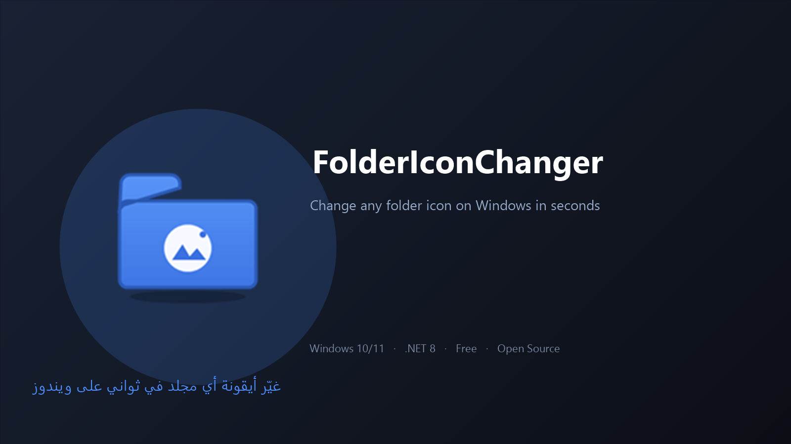

<p align="center">
  
</p>

# FolderIconChanger — غيّر أيقونة أي مجلد في ثواني

[](https://github.com/hus-bassi/FolderIconChanger/releases/latest)
[](LICENSE)
[]()

تطبيق ويندوز بسيط بالعربي، **مش محتاج برامج ولا خبرة**: تختار صورة + تختار مجلد → ضغط زر → الأيقونة تتغير فورًا، بدون ما تعمل `.ico` بإيدك أو تعدل في النظام.

> العيل اللي بياخد وقت معاك في Excel أو التصميم… ده بياخد **ثواني**.

---

## 🚀 تحميل سريع (Download)

اضغط الزر 👉 [**Get FolderIconChanger.exe**](https://github.com/hus-bassi/FolderIconChanger/releases/latest)

- **ملف واحد** — EXE جاهز، شغّال على أي ويندوز 10/11 من غير ما تنصّب .NET.
- **مجاني 100%** ومفتوح المصدر.
- أول تشغيل لو ظهرت رسالة SmartScreen: اضغط **More info → Run anyway**.

---

## ✨ فيه إيه (Features)

| | |
| --- | --- |
| 🖼️ | تختار صورة PNG / JPG / BMP — أو تسحبها بالـ Drag & Drop |
| ⚡ | التطبيق بيحولها لـ **ICO حقيقي متعدد المقاسات** (16 → 256) أوتوماتيك |
| 📁 | بيظبط `desktop.ini` والأتريبيتات اللي ويندوز محتاجها — بنفس أسلوب ويندوز |
| 🔄 | تحديث فوري للـ Explorer من غير ما تعيد تشغيل |
| ↩️ | **Restore** يرجع الأيقونة الافتراضية (وحتى يرجع أي أيقونة قديمة كانت موجودة) |
| 🌙 | واجهة دارك حديثة، وبيحفظ آخر مكان شغلت عليه |
| 🛡️ | مبيلمسش غير ملفات بتاعته بس، ومعاه log داخلي |

## 🎬 كيفية الاستخدام (3 خطوات)

1. افتح `FolderIconChanger.exe`
2. اختر **الصورة** → اختر **المجلد** → اضغط **Apply Icon**
3. خلاص … لا إعادة تشغيل ولا حاجة

---

## 🛠️ Build / Publish

عايز تعمل نسختك بنفسك؟ (محتاج .NET 8 SDK)

```powershell
dotnet build FolderIconChanger -c Release

# اه، لو عايز EXE واحد متنقل (self-contained)
dotnet publish FolderIconChanger -c Release -r win-x64 --self-contained true `
  -p:PublishSingleFile=true -p:IncludeNativeLibrariesForSelfExtract=true -o publish
```

## 🔒 CLI (للسكربتات / للاختبار)

```powershell
FolderIconChanger.exe apply "C:\photo.png" "C:\MyFolder"     # غيّر الأيقونة
FolderIconChanger.exe restore "C:\MyFolder"                   # رجّع الافتراضي
```

## 🧪 Tests

```powershell
& .\tools\run-tests.ps1        # بيجرب كل الحالات end-to-end على الـ EXE الجاهز
```

## 🗂️ بنية المشروع

| Path | يعمل إيه |
| --- | --- |
| `Services\IconGenerator.cs` | توليد الـ .ICO متعدد المقاسات |
| `Services\FolderIconService.cs` | تطبيق/استرجاع + محرر `desktop.ini` |
| `Services\ExplorerRefreshService.cs` | تحديث Explorer (`SHChangeNotify`) |
| `Services\FolderPickerService.cs` | نافذة اختيار مجلد ويندوز الأصلية |
| `Cli\CliRunner.cs` | وضع CLI مخفي + دعم `@argfile` |
| `MainWindow.xaml(.cs)` | الواجهة الدارك + Drag & Drop |
| `tools\run-tests.ps1` | اختبارات التكامل |

---

## 📜 License

MIT — استخدمه، عدّله، علّمه، اعمله إيه اللي انت عايزه. 💙